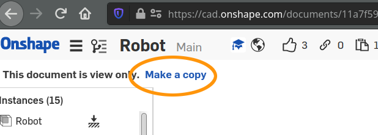
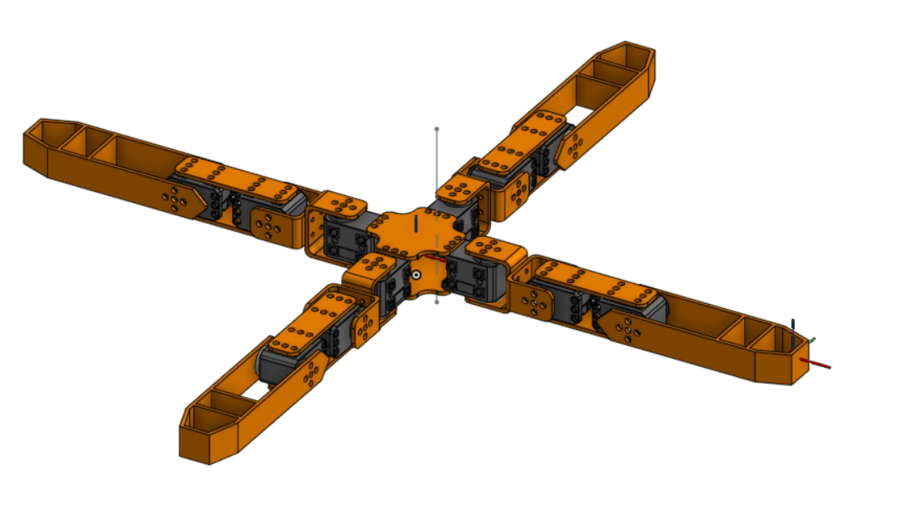

# Onshape to robot examples

Here you will find several examples of robots that were design to be exported properly using the
[onshape-to-robot](https://github.com/Rhoban/onshape-to-robot) tool.

Have a look at the [design-time considerations](https://github.com/Rhoban/onshape-to-robot#design-time-considerations)
to understand better the constraints to export your robots to URDF/SDF.

This repository contains both `config.json` file and resulting URDF, SDF and STL files. Thus, they can seen in a
physics environment easily using:

    onshape-to-robot-bullet [directory]

This will open a windows like the following one, including sliders to change the degree of freedom positions:

## Re-running the imports yourself

### Instructions

Read the instructions from the [onshape-to-robot repository](https://github.com/Rhoban/onshape-to-robot), especially
be sure to have the API key registered and set as environment variable before running `onshape-to-robot`.

### Why do I get `ERROR (403) while using OnShape API` ?

If you want to export the robots yourself, you need to have the rights to access to the assembly. Thus, if you want to
re-run the import for the examples in this repository, you will have to make your own copy of the document. Fortunately,
this is quite simple because it is just about clicking on that button on top left:

Then, change the `documentId` in `config.json` of the robot to match the new document created where you own the robot
design.

## Robots

### Quadruped

[Onshape link](https://cad.onshape.com/documents/11a7f59e37f711d732274fca/w/7807518dc67487ad405722c8/e/5233c6445c575366a6cc0d50)

This is a 12 DOF quadruped robot, with design similar to the [Metabot open-source project](https://github.com/rhoban/metabot).

Collisions are provided with fully pure shapes, there is one frame in the body and one frame in the tip of one of the legs.