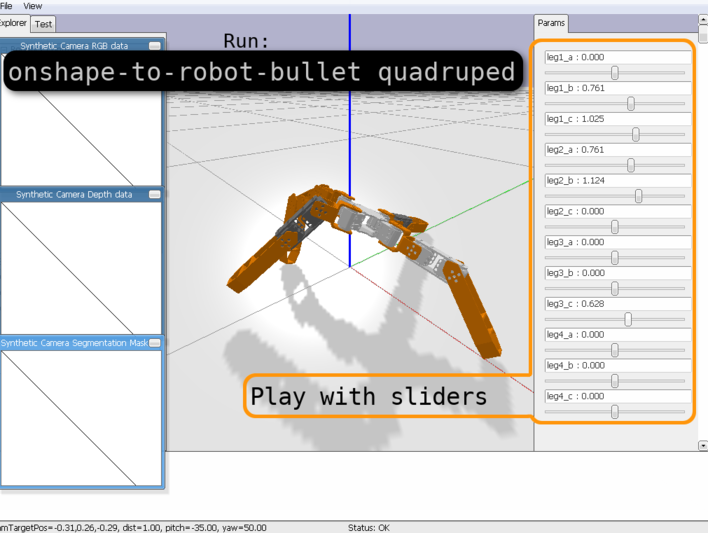
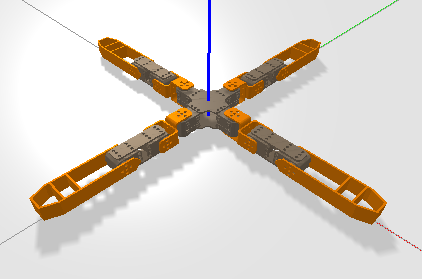

# Onshape to robot examples

Here you will find several examples of robots that were design to be exported properly using the
[onshape-to-robot](https://github.com/Rhoban/onshape-to-robot) tool.

Have a look at the [design-time considerations](https://onshape-to-robot.readthedocs.io/en/latest/design.html)
to understand better the constraints to export your robots to URDF/SDF.

Before testing, in a nutshell, you need `onshape-to-robot`:

    pip install onshape-to-robot

This repository contains both `config.json` file and resulting URDF, SDF and STL files. Thus, they can seen in a
physics environment easily using:

    onshape-to-robot-bullet [directory]

This will open a windows like the following one, including sliders to change the degree of freedom positions:

## Robots

### 2 wheels

Description: Very simple design and minimalistic configuration

* Give it a try: `onshape-to-robot-bullet 2wheels`
* [Onshape design](https://cad.onshape.com/documents/862948a6ea6d38343e1d3272/w/98cee18311a3b8d7c10abc42/e/9332fc5299824befd8ebf702)
* [config.json](2wheels/config.json)
* **Note: joints names ends with `_speed`, which makes `onshape-to-robot` use speed control by default**
* **Note2: here, `wheel2` has the `_inv` suffix, which changes its direction making both wheels spin in same direction
  when same sign of order is given**

### Adjustable height arm

Description: Robot with 4 degrees of freedom, one prismatic (linear) joint and 3 rotations

* Give it a try: `onshape-to-robot-bullet -f adjustable_height_arm` (note that `-f` is passed to fix the base to the ground)
* [Onshape design](https://cad.onshape.com/documents/6a6e5b10ef079339c2ddde84/w/207da6d79692e0bbf50113f2/e/9f3edd12689fa0c486a7d0d7)
* [config.json](adjustable_height_arm/config.json)
* There is one frame (`frame_tip`) attached to the tip of the arm

### Omnidirectional

Description: Example of (not implemented) omnidirectional robot using omni wheels (holonomic)

* Give it a try: `onshape-to-robot-bullet omnidirectional`
* [Onshape design](https://cad.onshape.com/documents/11c3398e78edfadf952cbdbc/w/4428506b5bb6358b44ff6764/e/975412fdc0fd0ba9ca2cf7b6)
* [config.json](omnidirectional/config.json)
* Each small wheel is a degree of freedom. This is not very hard to do, even though a little tedious.
* There is a frame (`frame_body`) in the very center of the robot. A visual arrow is part of the plate to indicate the
  front (axis X) of the robot.

### Quadruped

Description: 12 DOF quadruped robot, design similar to the [Metabot open-source project](https://github.com/rhoban/metabot) using
[XL-320](http://emanual.robotis.com/docs/en/dxl/x/xl320/) servos.

* Give it a try: `onshape-to-robot-bullet quadruped`
* [Onshape design](https://cad.onshape.com/documents/11a7f59e37f711d732274fca/w/7807518dc67487ad405722c8/e/5233c6445c575366a6cc0d50)
* [config.json](quadruped/config.json)
* Full pure shape approximation (OpenSCAD) for collisions
* Frames in the trunk (`trunk_frame`) and in the tip of one leg (`tip_frame`)

### Dog

Description: 12 DOF dog robot, made for fun with [MX-64](http://emanual.robotis.com/docs/en/dxl/mx/mx-64-2/) servos (was actually built)

* Give it a try: `onshape-to-robot-bullet dog`
* [Onshape design](https://cad.onshape.com/documents/adaeaba919da3242f78691a7/w/d80460ae3edd273c69c822a5/e/c8ebe3aba51c8ed2734fad87)
* [config.json](dog/config.json)
* No pure shape approximation (pure STLs)
* Dynamics is overridden for MX-64 and MX-106, since it is provided by constructor

### Sigmaban2019

Description: 20 DOF humanoid robot, snapshot of 2019 Sigmaban model from team [Rhoban][https://www.youtube.com/watch?v=tF0cr0PYjsk),
used at RoboCup kid size

* Give it a try: `onshape-to-robot-bullet sigmaban2019`
* [Onshape design](https://cad.onshape.com/documents/41654e89e61a392d020b728c/w/d555ceec170d351622b789de/e/4c9a04a707c36ac7ad2ca0f8)
* [config.json](sigmaban2019/config.json)
* Full pure shape approximation (OpenSCAD) for collisions
* Dynamics is overridden for [MX-64][http://emanual.robotis.com/docs/en/dxl/mx/mx-64-2/)
and [MX-106](http://emanual.robotis.com/docs/en/dxl/mx/mx-106-2/), since it is provided by constructor
* Pure shapes are rendered for speed, you can set `drawCollisions` do false and re-run import to have real meshes visual
  * (To lighten the repository, meshes were not committed)
* Frames in the trunk (`trunk_frame`), in feet (`right_foot_frame`, `left_foot_frame`), the camera
(`camera_frame), the head base (`head_base_frame`) and some location to use Vive tracker for ground-truth
(`vive_frame`).

### Field

Description: This is not actually a robot, but an environment that is designed in Onshape and can be converted into an URDF file

* Give it a try: `onshape-to-robot-bullet field`
* [Onshape design](https://cad.onshape.com/documents/7c9b2b33f4117af700005b74/w/eec38b17995152d190f4b18a/e/82b08cac68e6478dadc7fda9)
* [config.json](field/config.json)
* Note that the `noDynamics` is set to `true` in the configuration, making it a static environment
* This is a model of RoboCup humanoid soccer kid-size (2019) 6 x 9 m field
* The `useFixedLinks` option is set to `true` so that the colors of different sub-part are kept

## Re-running the imports yourself

### Instructions

Read the instructions from the [onshape-to-robot repository](https://github.com/Rhoban/onshape-to-robot), especially
be sure to have the API key registered and set as environment variable before running `onshape-to-robot`.

To get the same results, you might need `openscad` and `meshlab` installed.

    sudo apt-get install openscad meshlab

Else, pure shape approximation and meshes simplification might be disabled.

### Why do I get `ERROR (403) while using OnShape API` ?

If you want to export the robots yourself, you need to have the rights to access to the assembly. Thus, if you want to
re-run the import for the examples in this repository, you will have to make your own copy of the document. Fortunately,
this is quite simple because it is just about clicking on that button on top left:

Then, change the `documentId` in `config.json` of the robot to match the new document created where you own the robot
design.

### Why the colors are looking weird in pyBullet ?

Actually, pyBullet does only keep one color per link currently in the viewer. This is a known limitation that does not
affect your physical simulations.
(https://github.com/bulletphysics/bullet3/issues/2650)

For instance, the quadruped robot above will look like this:

